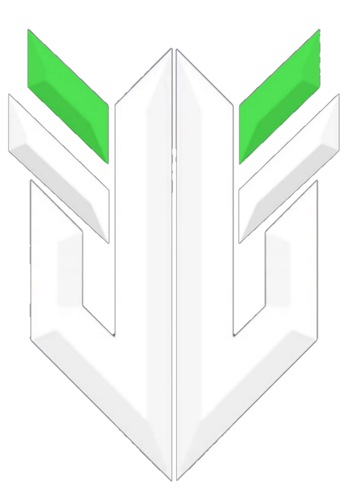

# 💫 About Me:
| Full-Stack & Python Developer | | Generative AI & Gaming Enthusiast | | Proficient in React, Node.js, Django, MySQL | | BTech CST'27 |

## 👤 **Socials**  
<table width="100%">

<tr>
  <td align="left">
      
    </td>
    <td align="right">
      
      
      
      
      
    
    </td>
  </tr>
  

</table>

# 💻 Tech Stack:
                     
# 📊 GitHub Stats:
 

---

<h2>❤️ Support Me</h2>

<a href="https://www.buymeacoffee.com/https://buymeacoffee.com/iamdipayandutta">

  
